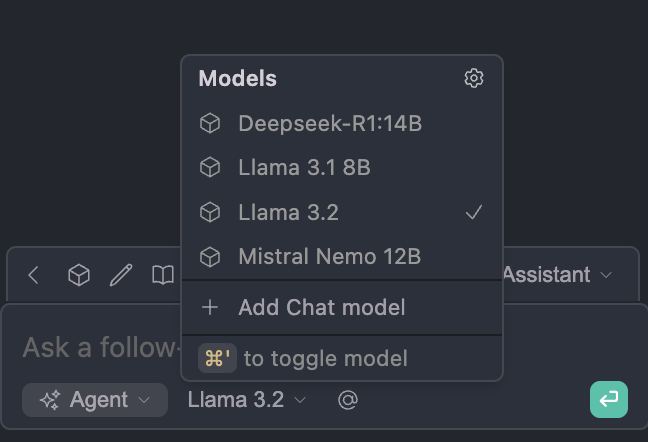

# MCP Ollama Server Integration with Continue.dev


This tutorial focuses on running a LLM locally and integrating a custom MCP server with the Continue.Dev Plugin for VSCode.

After completing this project you should be capable of:

1. creating and running your own custom MCP servers either locally or hosted somewhere. 

2. leveraging local running LLMs in your VSCode to connect to the custom MCP Server you've built. by connecting them to `Continue.Dev`

## MCP Server

for this project we will be leveraging `FastMCP` with Python to build our MCP Server. The Server will offer a single `tool` to help users find the closest park in Portland based on their location. The code for this is located in the [server.py`](./server.py)

### Defining our MCP Server

we will create a `.env` for use to control the `HOST` and `PORT` that our server will run on. let's keep it basic with the following configurations.

```.env
PORT=5173
HOST=127.0.0.1
```

**Create our MCP Server**

we will leverage the `FastMCP` constructor to create the server and then supply the `host` and `port` parameters to create our `mcp` server object.

```python
load_dotenv()

PORT = os.getenv("PORT")
HOST = os.getenv("HOST")

mcp = FastMCP(name="Local MCP Server", host=HOST, port=PORT)

```

Now that our server is defined let's give it a simple tool.


### Basics of Tools in MCP

`tools` are basically large or small functions that allow an LLM to execute a task on your behalf. for simplicity we will have the model read from a mock database [db](/db/parks.json) file. This file contains a JSON file of my favorite parks in Portland.

**parks.json File**

```json
{
    "north": [
        "Cathedral Park",
        "Pier Park"
    ],
    "northeast": [
        "Overlook Park",
        "Irving Park"
    ],
    "southeast": [
        "Mt. Tabor Park",
        "Powell Butte Park"
    ],
    "southwest": [
        "Washington Park",
        "Gabriel Park"
    ],
    "northwest": [
        "Forest Park",
        "Wallace Park"
    ]
}
```

ideally when the user supplies a query such as:

>I am looking for parks in the SouthWest area of Portland

it will call our new `choose_pdx_parks` tool and locate parks for that region. As you can see above it should respond with two parks either:

* Washington Park
* Gabriel Park

The tool logic is pretty simple. The model will reference/call the `choose_pdx_park` method because we will have provided the 
`@mcp.tool` decorator. then the logic for a model to understand the context of when this tool is used is provided. Often there is a very detailed explanation of how to use it, to keep the model from straying off. this is the tool definition/description.

**Tool Function Definitions**

Basically following a standard method description we will provide this for the model to describe out tool. 

```python
'''
    choose a park based on the incoming location provided by the user. 
    if nothing is matchable for the `location` provided, returns the suggestion to search for a park at the PDX parks 
    website.
    
    Args:
        location (str): corresponds to the location where the user is to search against
    Returns:
        park_recommendation (str): the chosen park closest to the specified user location
'''
```

then we will define the logic for the function. Basically we will open the file and search for the `location` provided from the user to offer park recommendations. The model will likely know these parks and offer an explanation of each one for the user. 

*These parks are common knowledge and this technique is why MCP shines for chatbots.*

```python
@mcp.tool
def choose_pdx_park(location: str) -> str
    
    # Open and parse the options for user recommendation
    try:
        with open("./db/parks.json", "r") as parks_file:
            
            pdx_parks = json.load(parks_file)
            
    except FileNotFoundError:
        print(colorama.Fore.YELLOW + "Error: \n Parks Database File not found")
    except json.JSONDecodeError:
        print(colorama.Fore.YELLOW + "Error: \n `parks.json` is not properly formatted please check the source file for this tool.")
    except Exception as err:
        print(colorama.Fore.RED + f"Error: something went wrong... \n {err}")
    
    # attempt to access the provided location
    search_loc = location.strip().lower()
    
    if search_loc in pdx_parks:
        park_options = pdx_parks.get(search_loc)
        
        park_suggestions = f"it appears you are looking for parks in the: {search_loc} \n here are some suggestions \n "
        for park in park_options:
            park_suggestions += f" * {park} \n"
        
        return park_suggestions
    else:
        return """
                invalid location request provide one of the following: \n
                
                * 'north' \n
                * 'northeast' \n
                * 'southeast' \n
                * 'southwest' \n
                * 'northwest' \n
                """
```

The logic here is simple to understand. The model has only a few options to parse from the user as input and will respond if the input is invalid with:

```python
"""
invalid location request provide one of the following: \n

* 'north' \n
* 'northeast' \n
* 'southeast' \n
* 'southwest' \n
* 'northwest' \n
"""
```

#### Running the Server

let's develop the code that will call the `run()` method on our MCP server.
it's a simple one liner. 

```
if __name__ == "__main__":
    mcp.run(transport=<chosen_transport>)
```

for simplicity we will focus at first on `STDIO` the actual method will take the `transport="stdio"` to establish this protocol. making the method look this.

```python
if __name__ == "__main__":
    mcp.run(transport="stdio")
```

there are two ways you can call the python file and actually run the mcp server.

**MCP Inspector Mode**

`fastmcp dev server.py`

*this method will likely install an `npx` package for you the first time in the terminal. That's normal.*

running the server in inspector mode will allow you to interact with the tools you have developed under the resources/tools section. This option is for playing around the inspector and making some queries yourself. 


**Python Run Server**

the way we will emulate this server when configuring `Continue.dev` we will opt for the `python server.py` mode, but this will handle the logic to connect things up and server our MCP Server locally or even on a remote server for you.


#### Continue Plugin Integration

[Configuration Details For MCP with YAML](https://docs.continue.dev/customize/deep-dives/mcp#streamable-http-transport)
Continue offers a few types of protocols to connect an MCP server locally. Continue will provide the models and context that will be required to send off the prompts to your local running `Ollama`. Following to guidance and choose a model that supports tool use in order to ensure that when Continue is switched to `Agent` mode that it is able to leverage your MCP Server tools. For this project we have chosen `Llama3.2` Feel free to choose another model if you have a specific preference.

**Pull Llama3.2 with Ollama**

`ollama pull llama3.2:latest`

**Configure Your Model/Models with Continue**

despite how/where you have your models loading from. [Ollama Model Configuration Details]() you will need to allow them to interface with continue. Open the plugin and click the Kog after clicking the model button near the bottom.



Supply the following details to the YAML configuration file to add `Llama3.2` to the `models:` section of the `config.yaml` that opens.

```yaml
name: Local Assistant
version: 1.0.0
schema: v1
models:
 - name: Llama 3.2 
    provider: ollama
    model: llama3.2:latest
    roles:
      - chat
      - edit
      - apply
    capabilities:
      - tool_use
```

**Run Ollama**

open a terminal and run the following command

`ollama run`

this ensures the models you have pulled are available for your continue plugin.

**What We've Done So Far**

So far we have created an the `MCPServer` pulled the latest version of `Llama3.2` with `Ollama` and have the model running with `ollama run`. We need to connect our plugin to the MCPServer so that we can casually code along and make calls to our tools. Next I will cover two types of transport protocols that can connect our running MCP server to Continue.

#### Stdio MCP Server
 
 `STDIO` or standard in and standard out. Is reserved for Clients that are using input and output via text from one process to another process, this makes sense for clients that act take input from the terminal or a script to execute calls to an MCP server.

 [STDIO](https://modelcontextprotocol.io/specification/2025-06-18/basic/transports)

**Local MCP Server Yaml**

this configuration is required for STDIO, the fields that are needed are the `type: stdio` this dictates the transport. we will also need the command to execute the file. `uv` is the only command I was able to use. `uv` is another *(much better)* package manager for python. and the `args` which is a little more complex depending on your project. For example here. we supply a `--directory` which will move the operation to the absolute path of the project. then `run` to run the python file `./server.py` which is the server in question.

```yaml
name: PDX Parks Server
version: 0.0.1
mcpServers:
  - name: PDX Parks Tool
    type: stdio
    command: uv
    args:
      - --directory
      - /Users/goodguygregory/Github/mcp-slm-ollama/
      - run
      - ./server.py
```

#### Streaming HTTP Transport 

In order to configure streaming support for HTTP clients to connect to your hosted `mcpserver`. Continue will need to have access to the protocol transport type of your server. we will need to configure

**Streamable HTTP Transport**

```yaml
name: PDX Parks Server
version: 0.0.1
mcpServers:
# STREAMABLE-HTTP
  - name: PDX Parks Tool
    type: streamable-http
    url: "http://127.0.0.1:5173/mcp"
```


#### Documentation

[FastMCP Repo](https://github.com/cklapperich/fastmcp-39)  
[Official Documentation for Getting Started with FastMCP](https://gofastmcp.com/getting-started/welcome)  
[UV Basics](https://www.datacamp.com/tutorial/python-uv)  
[Client Development](https://modelcontextprotocol.io/quickstart/client)  
[Ollama MCP Stdio Client](https://medium.com/@jonigl/build-an-mcp-client-in-minutes-local-ai-agents-just-got-real-a10e186a560f)   
[Anthropic MCP SSE Client](https://www.f22labs.com/blogs/mcp-practical-guide-with-sse-transport/)   
[Adaptive Engineer MCP Server](https://newsletter.adaptiveengineer.com/p/build-a-custom-mcp-client-and-server)  

**Videos**

[FastMCP Overview](https://www.youtube.com/watch?v=5xqFjh56AwM)